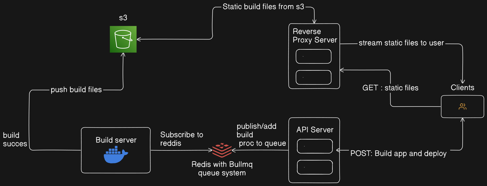

# Project Name: Vercel Build Automation

## Overview

This project is designed to automate the react build, deployment, and serving of static websites like on the Vercel platform using Docker containers and BullMQ for task queuing.

## Architecture



### Components

1. **build-server**: A server responsible for building React applications provided through GitHub URLs.
2. **api-server**: Provides an API endpoint to add GitHub URLs to a Redis queue with BullMQ.
3. **s3-reverse-proxy**: A reverse proxy server that serves static files from an S3 bucket to the end user.

## Setup

### Prerequisites

- Node.js
- Docker
- Docker Compose
- Redis
- s3 Bucket

### Installation

1. Clone this repository.
2. Navigate to the root directory of the project.
3. Run `docker-compose up` to start all three tiers of the application. (or) you can manually route to each directory and run `npm start`

## Usage

### API Server

- Access the API server via `http://localhost:4001`.
- To add a GitHub URL to the build queue, send a POST request to `/build` with the following JSON payload:
  ```json
  {
    "subdomain": "example-subdomain",
    "gitUrl": "https://github.com/example/repo.git"
  }
  ```
- A new build job will be added to the queue, and the API server will respond with a message and the URL where the app will be served.

### Build Server

- The build server listens for new jobs on the `build-queue` and processes them.
- It fetches the GitHub repository and initiates the build process.

### S3 Reverse Proxy

- The S3 reverse proxy serves static files from an S3 bucket.
- Access static files via `http://localhost:4003`.

## Environment Variables

- **REDIS_SERVER_HOST**: Hostname of the Redis server.
- **REDIS_SERVER_PORT**: Port of the Redis server.
- **S3_BUCKET_ACCESS_KEY**: Access key for the S3 bucket.
- **S3_BUCKET_SECRET_KEY**: Secret key for the S3 bucket.
- **S3_BUCKET_REGION**: Region of the S3 bucket.
- **S3_ENDPOINT**: Endpoint of the S3 bucket.
- **PORT**: Port for the API server and S3 reverse proxy.

## Contributing

1. Fork the repository.
2. Create your feature branch (`git checkout -b feature/fooBar`).
3. Commit your changes (`git commit -am 'Add some fooBar'`).
4. Push to the branch (`git push origin feature/fooBar`).
5. Create a new Pull Request.

## License

This project is licensed under the [MIT License](LICENSE).

## Acknowledgments

- [BullMQ](https://github.com/taskforcesh/bullmq)
- [Redis](https://redis.io/)
- [Docker](https://www.docker.com/)
- [Node.js](https://nodejs.org/)
- [Vercel](https://vercel.com/)
- [OpenAI](https://openai.com/)
